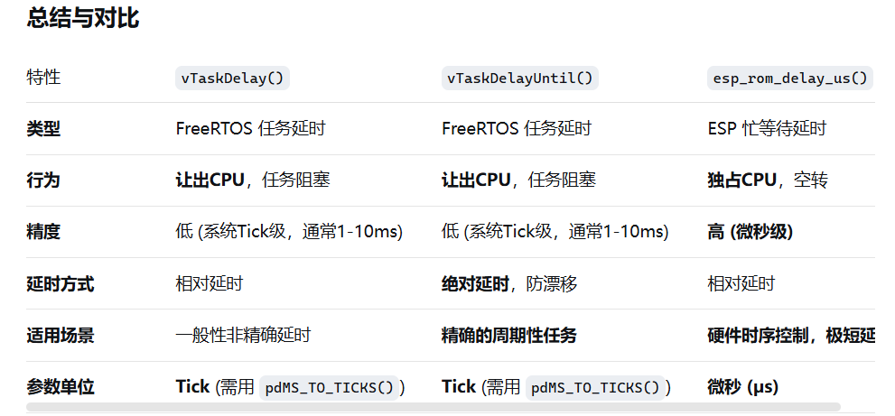

# vTaskDelay(ticks)

仅仅为了停一段时间,任务周期随意延长

* **功能特性** ：
* **相对延时** ： 延时是**相对于当前函数被调用时刻**开始计算的。
* **让出CPU** ： 调用此函数会使当前任务进入 **阻塞态 (Blocked State)** ，调度器会立即切换到其他就绪的最高优先级任务。这对于整个系统的效率至关重要。
* **最小延时单位** ： 延时时间以 **“系统心跳周期 (Tick)”** 为单位。心跳周期可在 `menuconfig` 中配置（通常为 10ms 或 100ms）。
* **函数参数** ：
* `const TickType_t xTicksToDelay`
  * 含义： 需要延迟的  **Tick 数** 。
  * 注意： 不能直接传入毫秒，需要使用宏 `pdMS_TO_TICKS()` 进行转换。

```
#include "freertos/FreeRTOS.h"
#include "freertos/task.h"

void my_task(void *pvParameters) {
    while(1) {
        // 任务工作代码...
        printf("Hello from my_task!\n");

        // 延迟 500 毫秒
        vTaskDelay(pdMS_TO_TICKS(500));
    }
}
```

总结: 任务阻塞函数,相对延时,一调用,开始计时,同时阻塞任务,让调度器转而执行其他**就绪的最高优先级任务(非阻塞)**

延时精度:ms


# vTaskDelayUntil(&previous wake_time,ticks)

这个函数用于实现 **固定频率的周期性延时** ，能有效解决 `vTaskDelay` 可能带来的时间漂移问题。

这个任务的周期要这么多就是这么多,精确严格

* **功能特性** ：
* **绝对延时** ： 延时是相对于一个**固定的基准时间点 (`previous_wake_time`)** 开始的，保证了任务循环的周期稳定性。
* **防止时间漂移** ： 假设你的任务执行本身需要一些时间（比如 10ms），如果你用 `vTaskDelay(100)` 来实现 100ms 的周期，那么实际的循环周期是 `10ms (执行) + 100ms (延迟) = 110ms`，产生了漂移。`vTaskDelayUntil` 会自动补偿执行时间，确保 **精确的周期** 。
* **适用场景** ： 需要严格定时执行的任务，如数据采样、控制循环、心跳包发送等。
* **函数参数** ：
* `TickType_t * const pxPreviousWakeTime`

  * 含义： 指向一个变量的指针，该变量保存任务 **上一次解除阻塞（唤醒）的时间戳** 。这个变量必须在任务循环外声明并初始化（例如用 `xTaskGetTickCount()`）。
* `const TickType_t xTimeIncrement`

  * 含义： 期望的 **循环周期** ，同样以 Tick 为单位。使用 `pdMS_TO_TICKS()` 转换

  ```
  #include "freertos/FreeRTOS.h"
  #include "freertos/task.h"

  void precise_task(void *pvParameters) 
  {
      TickType_t xLastWakeTime = xTaskGetTickCount(); // 获取当前时间戳并初始化
      const TickType_t xFrequency = pdMS_TO_TICKS(100); // 100ms 周期

      while(1) {
          // 任务工作代码... (假设这里执行需要一定时间)
          printf("This runs exactly every 100ms!\n");

          // 等待下一个周期到来
          vTaskDelayUntil(&xLastWakeTime, xFrequency);
      }
  }
  ```

总结:绝对延时,需要定下"时间锚点" ,即当前时间戳,时间延时严格,可看为加了补丁版的vTaskDelay()
(非阻塞)

# esp_rom_delay_us(uint32_t us)

这类函数实现的是 **“忙等待”** 或  **“阻塞等待”** 。它们会 **独占 CPU** ，在延迟期间不会让出 CPU 给其他任务。死等

这是最常用的忙等待延时函数。

* **功能特性** ：
* **高精度微秒级延迟** ： 延迟精度非常高，通常在微秒(?s)级别。
* **忙等待 (Busy-Wait)** ： CPU 会空转（执行 NOP 指令）直到时间到， **期间不会进行任务调度** 。
* **适用场景** ：

  * **底层硬件驱动** ： 操作 I2C、SPI、GPIO 等需要严格时序的协议。
  * **极短时间的延迟** ： 延迟几微秒到几毫秒的情况。 **绝对不要用于长时间延迟（如上百毫秒以上）** ，否则会严重破坏系统的实时性和响应能力。
* **函数参数** ：
* `uint32_t us`

  * 含义： 需要延迟的 **微秒数 (?s)** 。

```
#include "esp_rom_delay.h"

// 模拟一个 I2C 的 START 信号时序
void i2c_start() {
    SDA_HIGH();
    SCL_HIGH();
    esp_rom_delay_us(5); // 精确等待 5us
    SDA_LOW();
    esp_rom_delay_us(5);
    SCL_LOW();
}
```

总结: 精确的阻塞延时



# 黄金法则

* **在任务函数中需要进行延时（尤其是毫秒级以上的）时，永远首选 `vTaskDelay()` 或 `vTaskDelayUntil()`** 。这是保持系统多任务高效运行的基础。
* **只有在操作硬件、编写底层驱动、需要微秒级极高精度延时时，才使用 `esp_rom_delay_us()`** ，并且要确保延迟时间非常短。
* **永远不要在任务中长时间调用 `esp_rom_delay_us()`** ，这会让你整个系统“卡住”，无法响应其他任务或事件。

  # 感受

  实时操作系统和裸机的不同,裸机处理任务为一条线,主线是while(1),支线是中断,而这里的时间概念是建立在任务上的,每个任务都有其时间周期,需要精确管控任务执行周期就用vTaskDelayUntil(),仅仅为了停一段时间就用vTaskDelay()
