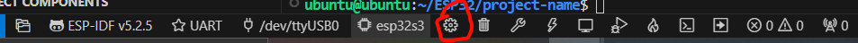

# 当前环境

Linux + Windows

在虚拟机上使用vscode搭建espidf环境,将端口的权限改成不用每次插入都改权限

开启ssh

在windows上使用REMOTE SSH来连接虚拟机,打开esp-idf系列文件夹,就能使用了,当然要在拓展那里下载esp-idf这样才能使用esp-idf界面,然后把当前ssh用户放在某个组里,这样就能进行烧录了,每次烧录前记得按下复位

现在虚拟机的espidf指令不能用在中端上,你只能在vscode里,按F1 或 ctrl + shift + p 输入ESP-IDF: Open ESP-IDF Terminal,这样就能使用系列指令了
终端简单的指令

在系列文件夹中打开上面说的终端

1.idf.py --version

查看当前esp-idf版本

2.idf.py build

编译工程

3.idf.py flash

烧录到板子的flash里
记得按复位

红色的地方可以改芯片类型

烧录的话用串口烧录

# 针对ESP32S3(嘉立创版本)

点这个SDK Configuration Editor

1. Flash

将Flash size 改为 8MB

2. PSRAM
   

   

   
   3. 主频

   

   想省电就160,不用省就240
   然后点保存

# 文件夹/文件添加

要在main文件以外添加外设文件夹如Hardware

由于ESP-IDF很讲究组件这个东西,所以我们就给它创建一个components文件夹(注:要是重命名其他文件夹了,你要把build文件夹给删了,重新编译,这个components的名字可不能改),components文件夹下创建一个大类的文件夹,如Hardware,

然后在Hardware下添加include 和 src子文件夹,前面的放.h 后面的放.c,建议在include文件夹下再添加个Hardware,以便和其他文件夹的同名文件区别
每创建完一个大类,都要带上CMakelists.txt文件,用途是添加文件路径(让编译器知道文件的存在)

大小写非常敏感要注意 就连 .c .C .h .H的区别都非常清楚

然后解决在windows环境里功能函数没有代码补全的问题

因为windows本地没有安装环境,所以就没有
