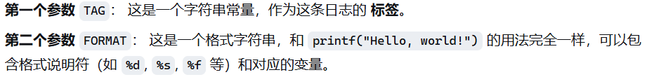
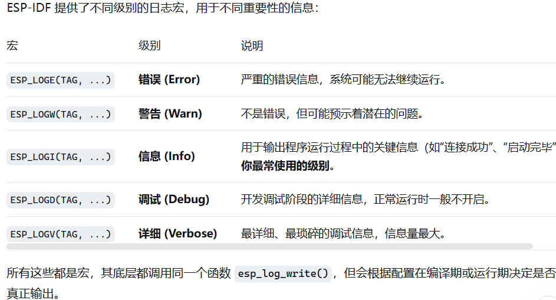

# ESP_LOGI(**tag**, **format**, **...**)

ESP-IDF 框架中用于输出 **信息级别 (Info)** 日志的宏。它输出的日志内容可以通过串口等工具看到,是开发和调试过程中非常重要的工具。



第一个参数的作用:为了表示这条日志来自于哪个 **模块** 、**功能块**或**组件**,方便溯源判断区域功能是否正常 `TAG` 的核心作用

TAG 的存在是为了实现强大的 **日志过滤和控制** 功能。在 ESP-IDF 中，你可以通过环境变量或 `idf.py menuconfig` 工具，根据 TAG 和日志级别来动态地设置哪些日志应该被输出。

例如，你可以：

* **只显示** TAG 为 `"wifi"` 的错误（Error）及以上级别的日志。
* **禁止**所有 TAG 为 `"http_client"` 的调试（Debug）日志，以减少日志输出量，让串口输出更清爽。
* 将某个特定 TAG（如 `"sensor"`）的日志级别从 Info 提升到 Verbose，以便更详细地调试传感器驱动。

如果没有 TAG，这种精细化的过滤控制就无法实现。
通常，我们**确实会**在每个源文件（`.c` 文件）的顶部定义一个属于该文件的 TAG，这样可以非常方便地追踪日志的来源。这是一种非常常见和推荐的做法。


```
// 在 main.c 文件中
#include "esp_log.h"

// 静态常量字符串，定义为该文件的 TAG
static const char* TAG = "main";

void app_main() {
    // 使用时直接传入定义好的 TAG
    ESP_LOGI(TAG, "Hello, world!");
    int count = 10;
    ESP_LOGD(TAG, "Device count: %d", count); // 使用格式字符串
}
```



***
    总结:一个能贴标签的printf()函数,非常方便调试***
