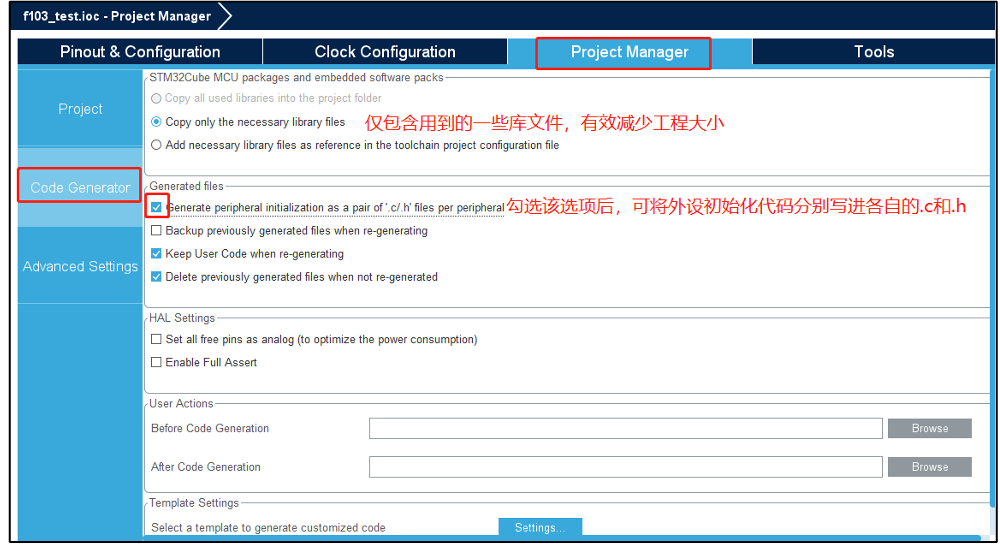

# 时钟配置

注意板上外部时钟晶振频率配置: **32.768KHz 8MHz 25MHz**

内部的一般为32KHz 和 16MHz

# 使用技巧

添加文件夹

添加完文件夹后,就可以添加源文件和头文件了,注意添加时要带文件类型后缀 ex: led.c led.h

上面这个方式可以直接在main.c里面#include "LED.H"

还有第二种方式直接对工程文件添加文件夹

然后再添加源文件和头文件,这种方式在#include 时需要添加绝对路径,如

根据文件的相对路径,从main.c文件连续退出两个文件夹,然后找到UART文件夹,才到uart.h头文件

# 工程复制

工程复制后,把debug文件夹和.launch文件删除,然后把.ioc的名字也改了
