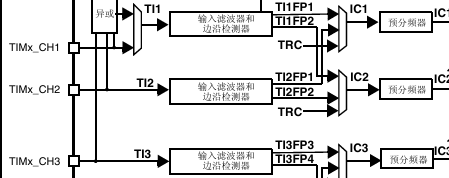

# 版本1

超声波模块HC-SR04,用通用定时器的输入捕获功能来获取距离

先说通用定时器的配置

时钟源选内部即可,时间单元选个1MHz的计数频率就可以了,但ARR的值要设置为最大的,防止经常溢出

然后是输入捕获部分,由框图可知

要配置输入滤波和边沿检测,这里不用滤波,然后就是边沿检测,这里是核心,先设置为上升沿模式,当回波传来的时候,触发中断,记录当前的计数值rise_time,然后将溢出次数的值清零,计数值的值重新开始,同时捕获标志位置1,将触发模式改为下降沿,)当下降沿到达时,读取当前计数值得fall_time,

计算中间高电平计数值即可乘于每记一个数所需时间即可得到高电平持续时间

然后通道映射,比如 TI1 和TI2都可映射到IC1

然后根据公式

` 距离 = (高电平持续时间 * 340 m/s) / 2 即可得到距离,需要进行单位转换`

如340 m/s  = 340 * 10^-6 * 10^2 cm/us = 0.034

需要用到滤波算法
