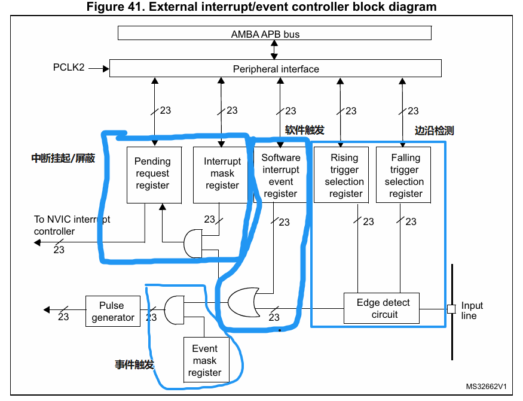

# EXTI

EXTI -----External(Extended) interrupt/event Controller

外部(扩展)中断事件控制器

包含20个产生**事件**/**中断**请求的边沿检测器

总共20条EXTI线(F1系列)

**注:无需时钟配置**

# 中断与事件

中断: 需要进入NVIC,有相应的中断服务函数,需要CPU处理

事件:不进入NVIC,仅用于内部硬件自动控制,如: TIM,DMA,ADC

# EXTI支持的外部中断与事件请求

# EXTI主要特性

对于F1/F4/F7系列

每条EXTI线都可以单独配置:

1.选择类型(中断或事件)

2.触发方式(上升沿,下降沿或双边沿触发)

3.支持软件触发

4.可开启/屏蔽 (中断/事件)

5.有挂起状态位(针对中断的,若该位置一了,说明产生了一个EXTI中断)

# 寄存器

## 1.边沿检测

EXTI_FTSR	--------下降沿触发选择寄存器

EXTI_RTSR  --------上升沿触发选择寄存器

## 2.中断请求/屏蔽

EXTI_PR	--------请求挂起寄存器

EXTI_IMR    --------中断屏蔽寄存器

# EXTI与IO映射关系

1.F1系列的EXTI和IO映射是由AFIO来配置的

2.F4/F7/H7 的是由SYSCFG来配置

## AFIO

AFIO -----------Alternate Function IO  复用功能IO 主要用于重映射和外部中断映射配置

1.调试IO配置	配置JTAG/SWD的开关状态

2.重映射配置	部分外设IO重映射配置(需要是能支持重映射的IO口)

3.外部中断配置 AFIO_EXTICR1~4 配置EXTI中断线  0 ~15 对应到哪个具体IO口

注: 配置AFIO寄存器前要使能AFIO时钟

## SYSCFG

SYSCFG --------System configuration controller	系统配置控制器  用于外部中断映射配置等功能

外部中断配置 SYSCFG_EXTICR1~4 配置EXTI中断线  0 ~15 对应到哪个具体IO口

注: 配置SYSCFG寄存器前要使能SYSCFG时钟

***统一表述:SYSCFG/AFIO的作用是:把某个引脚端口配置为EXITx的中断源或将 某个端口 映射到 EXTIX 中断线***

# EXTI与IO对应关系

每个IO口只能映射到一个EXTI线

如 Px0 -> EXTI0

不能两个IO口映射一个EXTI线,PA0 和PB0只能选一个

GPIO外部中断配置步骤(EXTI)

1.配置好GPIO(时钟,输入模式,上下拉输入情况)

2.使能AFIO/SYSCFG时钟

3.设置EXTI和IO对应的关系(联系起来)

4.设置EXTI(屏蔽,触发方式)

5.设置NVIC(中断优先级分组,设置优先级,使能中断)

6.设计中断服务函数	EXTIx_IRQHandler

注: STM32仅有EXTI0~4 ,EXTI9_5,EXTI15_10 7个外部中断函数
