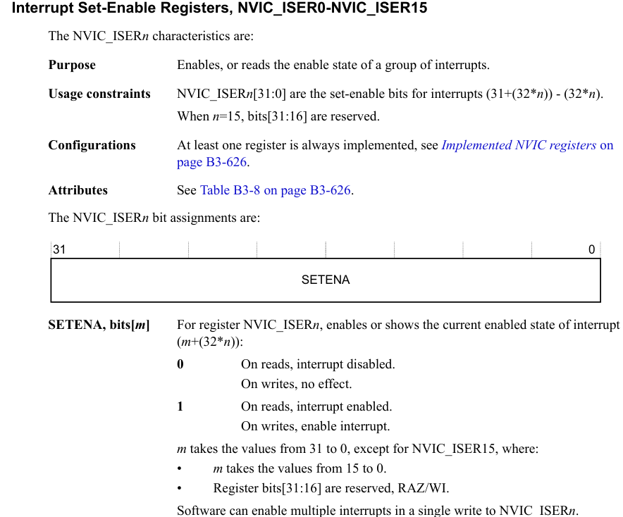
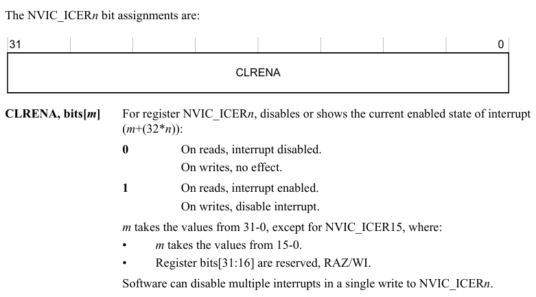
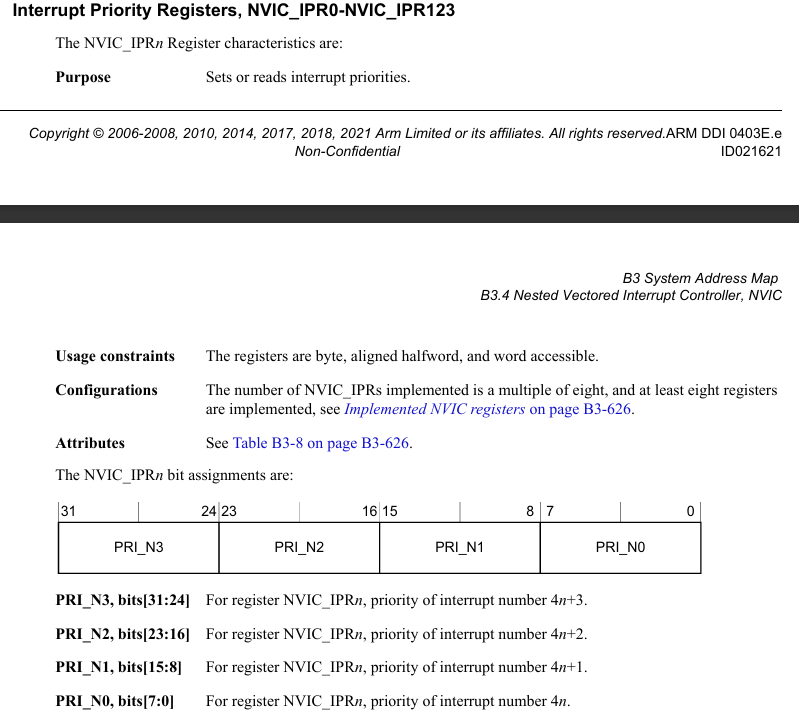
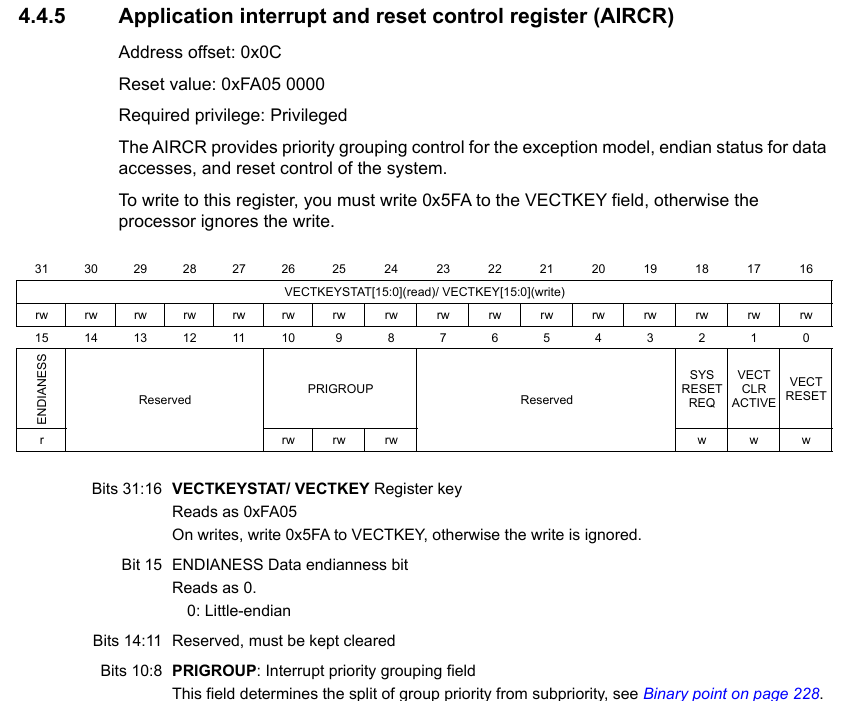
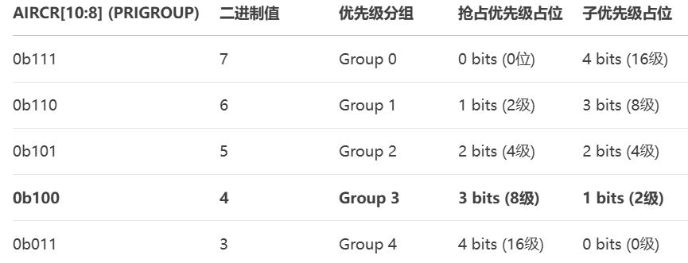

# NVIC

NVIC (Nested Vectored Interrupt Controller)

嵌套向量中断控制器

中断分为内部中断和外部中断

# 功能

1.中断管理(优先级分组,开启关闭中断)

2.优先级管理(给每个中断源分配优先级) 分为抢占优先级和响应优先级

3.中断嵌套: 允许高优先级中断抢占低优先级(抢占优先级高的可以直接打断当前执行的低抢占优先级中断)

注: 1.当抢占优先级一致时,响应优先级高的先执行(插队).但不能打断当前正在执行的中断程序  2. 当抢占优先级和响应优先级一致时,自然优先级高的优先执行(自然优先级 看中断向量表) 3. 数值越小,优先级越高

# 使用

1. 设置中断分组(整个工程只需要设置一次中断优先级分组)
2. 设置中断优先级
3. 使能中断

# 寄存器

1.SCB_AIRCR 		--控制中断优先级分组

2.NVIC_IPRx		--控制一个中断的优先级(8 bits 控制一个)

3.NVIC_ISER/NVIC_ICER		--控制一个中断使能/失能

下面两个详细看ARMv7-M Architecture Reference Manual

第一个看PM0214_STM32F4 Programming Manual

## NVIC_ISER/NVIC_ICER

Interrupt Set-Enable Register	一共有16个这样的寄存器NVIC_ISERx (0 -15)

中断使能置位寄存器		用于**使能中断以及读取中断状态**

NVIC_ISER0	管理中断号 0 - 31

NVIC_ISER1	管理中断号 31- 63  ....... 以此类推

首先要确定中断号,看stm32f4xx.h 就能确定大致位置,就像上图所示有个公式

中断号 =  m + (32 *n)	[ m	为某个ISER寄存器中的位号, n 为 ISER寄存器的索引号]

n  = 中断号 / 32	 m = 中断号 - (32*n)

例 USART1_IRQn 的中断号为37	 可知 n = 1;  37-32 = 5 说明USART1_IRQn的使能位在ISER[1]的5号位		NVIC->ISER[1] |=  (1 << 5);

搞定位置后,就可按照上图说的目标位写0或置1了,可通过位状态判断中断是否使能

NVIC->ICER也是一样的操作,就是把使能改为关闭了

## NVIC_IPR

Interrupt Priority Registers		中断优先级寄存器

设置每一个中断源的优先级	每个中断源都有自己独立的优先级配置(M内核最多支持240个中断源)

特点: 8位有效,但仅高四位可用,**每个32位的寄存器被分为4个8的字段,每个字段对应一个中断源的优先级**

每个8位字段中,只有高4位[7 : 4]是有效的,低4位[3:0]写入无效且读取为0

所以优先级就不是从0-255(2^8),而是0-15(2^4).

因为"每个32位的寄存器被分为4个8的字段,每个字段对应一个中断源的优先级""这个的缘故每个IPR只能配置4个中断源的优先级,	因此IPR0 管理中断号0-3 IPR1管理中断号4-7..

同样又是一个如何确定中断源所在哪个寄存器和哪个位(字段位置)的问题

首先确定中断号,然后 此时 令n为IPR寄存器编号,field为字段位置

n = 中断号 / 4		field = (中断号 % 4) * 8(在寄存器中的字节偏移)	注: 实际写入值时还需要移动四位如[15 : 8] -> [15:12]

知道所在位置后就开始设置中断优先级 其有效位为4位,(在优先级分组为2,也就是抢占优先级和相应优先级各占2位的情况下)前2位为抢占优先级位,后两位为响应优先级位

例 :优先级分组为2 0x9 => 1001 表示抢占优先级为2,响应优先级为1, 要将值放到寄存器中,需要左移12位

PA0对应的EXTI0的中断号为6	放在NVIC_IPR1 的 16 个字段 [23 : 16] [n + 8 - 1 : n]

有效位为[23 : 20]	16+4 左移4位

这是访问方式1

**还有另外一种访问方式,更加人性化把中断优先级搞成一个数值 NVIC_IP[240],240个8位寄存器组成的数组,同样每8位寄存器直接对应一个中断源的整个8位优先级字段(高4位有效)**

例: NVIC->IP[6]		这个代表着6号中断号 即EXTI0

NVIC->IP[6] |= 0x9 << 4;		代表将EXTI0设置成2位抢占优先级,1位响应优先级

## SCB_AIRCR

System control block 	application interrupt and reset control register

应用中断和复位控制寄存器

该寄存器用于控制整个系统的中断优先级分组,软件复位以及向量表定位

由图可知,在将值写入寄存器前,需要往里面的VECTKEY位写入0x5FA (0X5FA << 16)

我们的目标为[10:8]的PRIGROUP	即 设置中断优先级分组

SCB->AIRCR &=  ~(0x7 << 8);

SCB->AIRCR |=  (0x5 << 8);		// 将优先级分组设置为2
