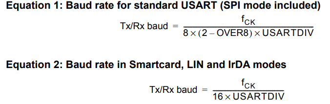

# 通信基础

## 串行和并行

串行: 数据逐位按顺序依次传输	特点:传输速率低,抗干扰能力强,通信距离长,成本低,占用IO口少

并行:数据各位通过多条线同时传输 特点: 传输速率高,抗干扰能力弱,通行距离短,成本高,占用IO口多

## 单工/半双工/全双工

传输方向

是否可同时发送

## 同步/异步

是否有同步时钟,时钟线?

## 波特率和比特率

比特率: 每秒发送的**比特**数, 单位: bit/s

波特率: 每秒发送的**码元**数 单位: Baud

比特率 = 波特率 * log2 M  	M表示每个码元承载的信息量

# UART

UART --

# 波特率计算

USART_BRR 	baud rate register

该寄存器是为了给接入串口控制器的高速时钟降频的,降到目标波特率的16倍即baud16,这个时钟才是进行串口通信的关键,之所以是这个公式就是要知道在已知目标波特率的情况下求它的分频系数

过采样 16 或 8 F4专属 OVER8 取 0 则为16倍采样, 取1为8倍采样

16倍更准确,8倍更快



要求USARTDIV这个值,一般都把OVER8设置成0,即16倍采样

要是把over8设置为0,则有个快速公式:(处理后(移位))的)USARTDIV = (fck + baud / 2) / baud  (有四舍五入的情况)

要是不用四舍五入则USARTDIV(移位后) = fck / baud;

四舍五入最终版:USARTDIV() = (fck * 2 + baud) / (baud * 2)	(16倍采样版本)

四舍五入最终版解释: 

参考手册上的USARTDIV需要乘于16才能进入BRR(波特率寄存器)的整数部分(相当于移动4位)

在OVER8 = 0(16倍采样的情况下) USARTDIV = Fck / 16 * Baud  移位后 DIV = Fck / Baud	(无四舍五入版本,直接整数截断)

注: 无论是整数还是小数都需要*16,一个是为了移动4位进入BRR寄存器(整数部分),另一个是为了能存入寄存器才乘16(小数部分)

插入四舍五入公式 (a + b/2) / b	

所以四舍五入版: DIV = (Fck + Baud/2) / Baud	为了减少整数截断,上下乘于2

DIV = (Fck * 2 + Baud) / (Baud * 2) 所以就变为最终版本了

```
// 波特率  USART->BRR  要先得到DIV Fplck = 84Mhz (APB2) 
//   double temp;
//   uint16_t mantissa;
//   uint16_t fraction;
//   
//   temp = (float)(84 * 1000000 / (baud * 16));    // over8 = 0 16倍采样 
//   mantissa = temp;     // 获取整数部分
//   fraction = (temp - mantissa) * 16 + 0.5;   // 单位换算,把小数部分转化为能塞入BRR寄存器里面的值 加个0.5四舍五入
//   mantissa <<= 4;      // 左移到[16:4]的位置为小数部分腾开位置
//   mantissa = mantissa + fraction;  
//   // 直接上公式的话(无四舍五入的情况 mantissa = fck / baud)
//   USART1->BRR = mantissa;  // 波特率设置:115200
```

# 串口控制器16倍/8倍过采样的机理

## 驱动

高速时钟(APB2)或低速时钟(APB1)接入串口控制器(USART1/USART2)[这就是USART1/USART2时钟使能],时钟通过USARTx_BRR(波特率寄存器,但其实际上是个分频器,也就是个计数器)后时钟频率降频产生一个目标波特率的16倍的时序信号(baud16)(不是时钟,时钟定义:占空比为50%的方波)[这就是公式div = Fclk / 16*baud的由来],然后baud16通过一个4位计数器(过采样计数器),该计数器每15+1的时候(溢出归零的瞬间)会发送一次脉冲(很短),该脉冲的频率就是波特率.

## 接收采样

### 空闲状态

接收方在空闲时会以baud16的时钟频率来检测数据线电平(空闲检测)(空闲状态下,只在第8,9,10个baud脉冲点采样,确认是否为高电平,会进行多数表决)

### 起始位接收

这个串口带有检测电平信号的装置(异步**边沿检测**器),一旦出现下降沿(疑似起始位),该边沿检测器会发送1个触发信号,会执行两个操作,1.过采样计数器立刻强制清零,2.(进入确认起始位环节)当计数器计数到8(半个位周期)后,再度采样(采3次,此时的采样位为第8,9,10个baud16脉冲点,多数表决),同样,若出现2个或3个的低电平,则能确认该位(波特率周期上的位)就是起始位,从而确认了同步基准点(理论中心点,最稳定的时候),过采样计数器再度清零,此后每过一个位周期(过采样计数器15+1的时候(计数器溢出),也就是过了16个baud16的脉冲周期)采样3次(多数表决),如此直到停止位.

这个机制能实现位同步/字符同步(即收发双方的时钟时序同步,每一次传来数据帧都会同步,保证其通信精度符合要求)
