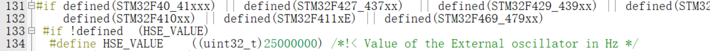
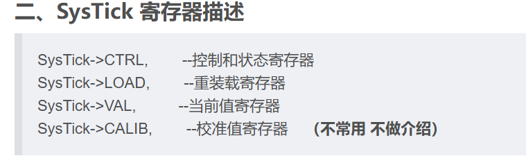
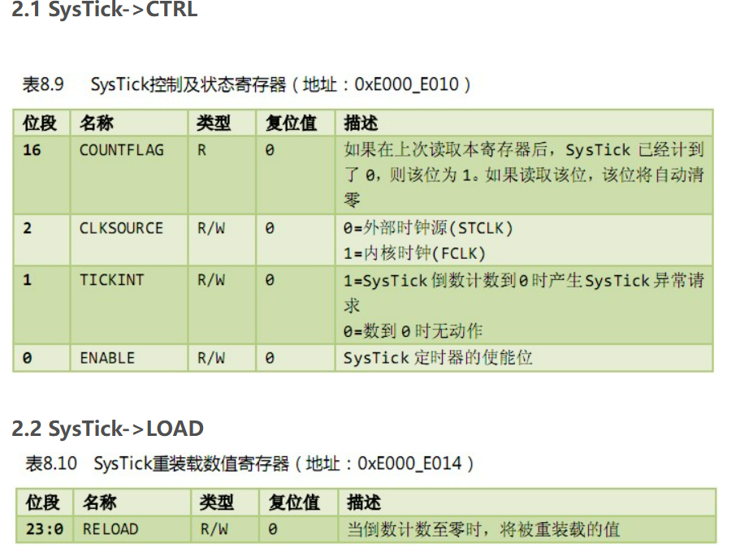
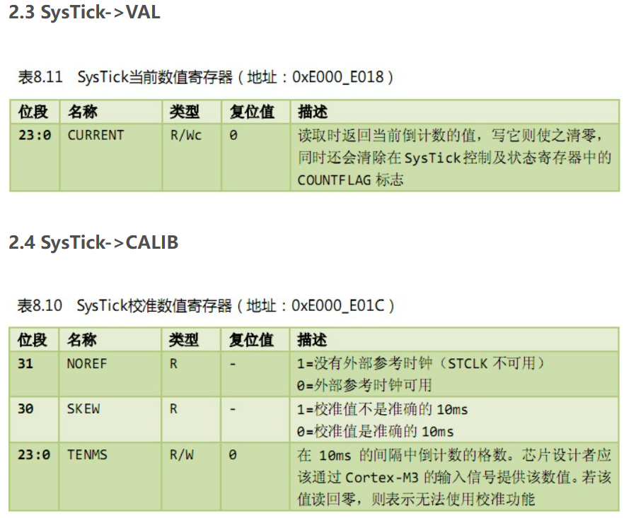
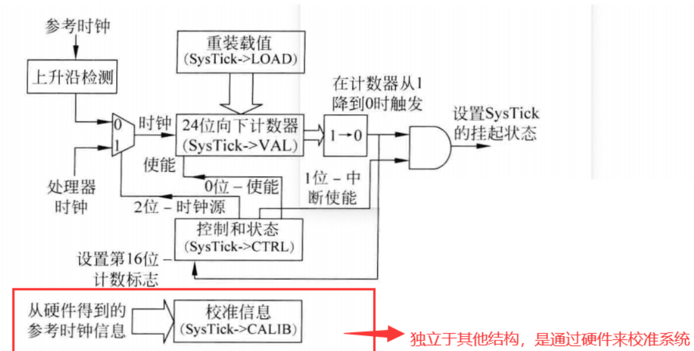

# 系统时钟初始化

Q: 系统时钟为什么要特定初始化?,正常配置完环境不就直接能使用外设了吗?(以STM32F4为例)

A:在搭建完环境后,在system_stm32f4xx.c/.h文件会自动帮你配置时钟系统(默认值),此时你需要看当前的开发板的外部晶振为多少 8MHz/25MHz,如果是前者,则你需要重新关注下分频系数和倍频系数了,

在配完以上的东西后,还要再关注下FLASH等待状态数一般在板电压输入为3V左右,看你的时钟频率然后配置即可,一般为5个等待状态数.

Q:其实分频器和倍频器本质上都是计数器吧?

不全是

分频器就是一个计数器(模N计数器,一共有N个计数大小,如N= 4 计数周期0-1-2-3-00),它是每检测到输入时钟的边沿(上升沿)就计数,在分频系数为N的情况下,计数到N后,才输出一次脉冲

倍频器

1.使能时钟(外部时钟/内部时钟)-- 四大时钟源:HSE HSI/HSI LSI(高速/低速 外部/内部时钟)

各大用途:

1. LSI一般用于作为独立看门狗的时钟源(IWDGCLK)

2.LSE一般用于作为实时时钟的时钟源(RTCCLK)

3.HSI 可直接作为系统时钟的时钟源,也可通过锁相环倍频后作为系统时钟的时钟源

4.HSE可直连系统时钟,一般通过锁相环倍频后作为系统时钟的时钟源(系统时钟一般用HSE来作为时钟源)

其实系统时钟初始化在system_stm32f4xx.c/.h文件里可以配置,外部时钟源频率在stm32f4xx.h里修改

就那个HSE_VALUE



实在不确定当前系统时钟配置如何,进入调试模式,搜索RCC寄存器 RCC_PLLCFGR这个,把里面的值复制给AI让AI分析

# SysTick

这东西叫滴答定时器,每次分析定时器前,要知道定时器的时钟源是谁,因为这决定了它的工作频率(最大工作频率)

可选两个时钟源一个是外部的就是如下图的来自HSE的时钟(21MHz)

    一个是来自内核的时钟,内核时钟频率为168MHz(F4)

而这个的时钟源如下图:










即系统时钟SYSCLK,对应F4系列,此时钟频率都为168MHz,经8分频后为21MHz

滴答定时器本质上是个**24位递减计数器** 0~1677215,可以给它存入一个值(重装载值),让它开始倒数,倒数到0后,它会置起标志位

这玩意有很多用法,比如阻塞延时和非阻塞延时,其中非阻塞延时能实现时间戳

# 阻塞延时

先说阻塞延时

    阻塞延时本质上就是将目标延时时间通过处理(乘于每微秒/毫秒的时钟周期数)后,放入SysTick->LOAD重装载寄存器中(顾名思义,当SysTick->VAL里的计数值减到0后,这个寄存器会将里面的值存入SysTick->VAL中,继续递减计数),

    每递减到0,SysTick->CTRL寄存器的第16位COUNTFLAG会置1(凭借这个来实现阻塞延时,while判断),这样就能根据你想要的延时时间来进行延时了,下面看细节

```
uint16_t cycle_per_us;
uint16_t max_delay_us;
// SysTick定时器初始化
void delay_init(uint8_t sysclk)
{
	SysTick->CTRL &= ~(1 << 2);		// 时钟源接入(AHB/8)
	cycle_per_us = sysclk / 8;		// 每微秒要执行多少个时钟周期
	max_delay_us = 0xFFFFFF / cycle_per_us;	// 最大延时时间.被除数为24位寄存器能存储的最大值
}
// 微秒延时基础函数
static void delay_xus(uint32_t xus)
{
	uint32_t load = xus * cycle_per_us;	// 延时时间处理
	if(load > 0xFFFFFF)
	{
		load = 0xFFFFFF;		// 防止超限
	}
	SysTick->LOAD = load - 1;		// 放入重装载寄存器中(为何要减一,因为从0开始数?是)
	SysTick->VAL = 0;			// 清空计数器里的值
	SysTick->CTRL |= (1 << 0);		// 启动定时器
	while(!(SysTick->CTRL & (1 << 16)));	// 等待计数完成标志位置起
	SysTick->CTRL &= ~(1 << 0);		// 关闭定时器
	SysTick->VAL = 0;			// 清空计数器里的值
}
// 微秒延时函数
void delay_us(uint32_t us)
{
	if(us > max_delay_us)			// 实现延时自由的关键,多的就拆开来延时
	{
		delay_xus(max_delay_us);
		us -= max_delay_us;
	}
	if(us > 0)
	{
		delay_xus(us);
	}
}
// 毫秒延时函数
void delay_ms(uint32_t ms)
{
	while(ms--)
		delay_us(1000);
}
```

上面就实现了阻塞式的延时函数,效果不错,但是会阻塞程序,我们的目标为实现非阻塞延时

# 非阻塞延时

要实现非阻塞延时,需要使用滴答定时器中断,将它设置为每毫秒触发一次中断,中断服务函数就只负责将计数值Tick加1,然后定义2个函数,一个负责根据判断时间差来实现延时,一个负责得到当前时间(计数值Tick)

下面看细节

```
SysTick_HandlerSysTick_Handleruint32_t Tick = 0;
// 滴答定时器中断初始化
void delay_interrupt(void)
{
	SysTick->CTRL &= ~(1 << 2);		// 时钟源接入(AHB/8)
	SysTick->LOAD = 21000 - 1;		// 每毫秒来触发一次
	SysTick->VAL = 0;			// 清空计数器
	SysTick->CTRL |= (1 << 1);		// 启动定时器中断
	SysTick->CTRL |= (1 << 0);		// 启动定时器
}

// 延时函数:根据时间差来判断延时是否达到目标
uint8_t Tick_ms(uint32_t start_time,uint32_t delay_ms)
{
	uint32_t current_time = get_current_time();
	if(current_time >= start_time)
		return (current_time - start_time) >= delay_ms;
	else 
		return (0xFFFFFFFF - start_time + current_time + 1) >= delay_ms;
}

uint32_t get_current_time(void)
{
	return Tick;
}

void SysTick_Handler(void)
{
	Tick++;
}

```

如此便实现了非阻塞延时,在使用前需要获取当前时间

ex:

```
uint32_ led1_time = get_current_time();
uint32_ led2_time = get_current_time();

while(1)
{
	if(Tick_ms(led1_time,500))
	{
		LED1_TOGGLE;
		led1_time = get_current_time();
	}
	if(Tick_ms(led2_time,500))
	{
		LED2_TOGGLE;
		led2_time = get_current_time();
	}
}
```

如此便实现了两个灯一不同频率闪烁

这个时间戳思想还可以用到按键外部中断里,挺好用,大致思路就是定义一个按键状态的结构体(包含按键按下标志位,按下时间)按键按下后,标志位置1,记录当前按下时间,创建一个中断按键处理函数,思路就是先判断是否按下(按键按下标志位是否置1,然后使用上面提到的利用时间差来实现延时的函数来实现非阻塞延时,然后判断按键电平状态,若符合按下状态,则进行相应的操作(灯翻转等等)),在末尾记得清楚按键按下标志位
