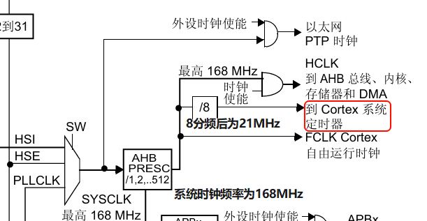

# # 系统时钟初始化

Q: 系统时钟为什么要特定初始化?,正常配置完环境不就直接能使用外设了吗?(以STM32F4为例)

1.使能时钟(外部时钟/内部时钟)-- 四大时钟源:HSE HSI/HSI LSI(高速/低速 外部/内部时钟)

# SysTick

这东西叫滴答定时器,每次分析定时器前,要知道定时器的时钟源是谁,因为这决定了它的工作频率(最大工作频率)

而这个的时钟源如下图:

即系统时钟SYSCLK,对应F4系列,此时钟频率都为168MHz,经8分频后为21MHz

滴答定时器本质上是个24位递减计数器 0~1677215,可以给它存入一个值(重装载值),让它开始倒数,倒数到0后,它会置起标志位
