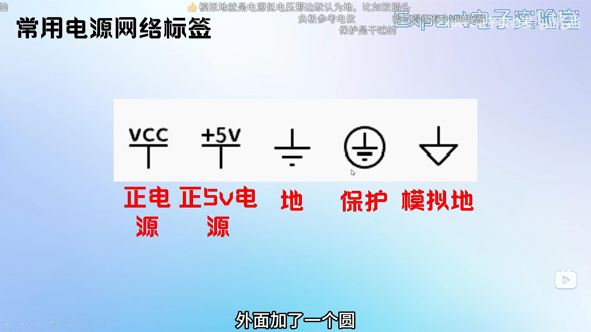
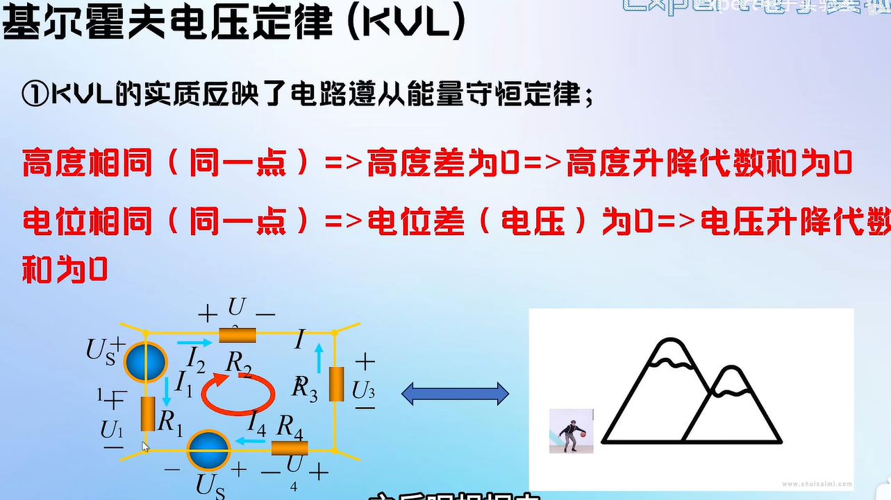
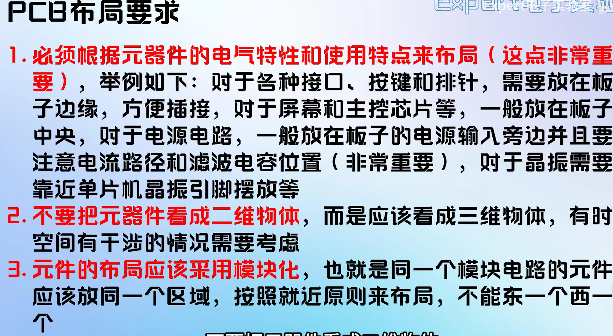

# 电阻


# 电容


# 电感


# 二极管


二极管导通压降越小越好,通常使用肖基特二极管

稳压二极管工作在反向击穿区,反向电流突变,但电压稳定


# 三极管


# 场效应管


# 电路图基础

原理图概念: 结点 网络标签




网孔是电路中最简单的回路,网孔数等于独立回路数

# 电路分析基础


一个实际元件可用一个到多个理想元件组合表示




# 原理图分析


# 电源来路

DCDC开关电源 		可高电压

LDO 线性稳压电源	适用低电压 对波形要求高的

# 单片机最小系统组成

1.供电的: 电源电路

核心部件:稳压芯片:AMS117-3.3或LM7805

作用就是把外部输入的不稳定电压(5V/12V)稳定地转换为单片机工作需要的精准电压(3V3或5V)

2.提供时钟信号的: 晶振电路

3.复位电路

4.下载电路?

```
1.供电电路 - 系统的“心脏”
组成：
电源输入：通常是USB接口、DC电源插座、或者简单的VCC/GND排针，用于引入外部电源（如5V或3.3V）。

稳压芯片：最核心的部件，如AMS1117-3.3或LM7805。它的作用是将外部输入的不稳定电压（如5V或12V）稳定地转换为单片机工作所需的精确电压（如3.3V或5V）。

滤波电容：
电解电容（通常10uF - 100uF）：用于滤除电源中的低频噪声，稳定电压。
瓷片电容（通常0.1uF）：用于滤除电源中的高频噪声，通常放置在稳压芯片的输入、输出端以及单片机的VCC引脚附近。

作用：
提供能量：为单片机及其外围电路提供稳定、干净、符合要求的工作电压。单片机如同大脑，没有稳定可靠的能源供应，一切功能都无从谈起。

稳压与滤波：消除电网波动和外部干扰，确保系统在任何情况下都能获得纯净的电源，防止单片机死机或复位。
2. 晶振电路 - 系统的“脉搏”
组成：
晶振：一个确定频率的石英晶体 oscillator，如11.0592MHz、12MHz、8MHz等。它为系统提供一个基准频率。
起振电容：通常两个容量很小的瓷片电容（如20pF - 30pF），分别连接在晶振的两端到地。

作用：
提供时钟信号：单片机内部的所有操作（指令执行、定时器计时、串口通信波特率等）都需要在统一的节奏下进行。晶振电路产生的时钟信号就是这个“节奏”，决定了单片机的工作速度。
同步协调：确保CPU、内存、外设等内部模块能够协调一致地工作。

补充：许多现代单片机（如STM32系列）都内置了RC振荡器作为时钟源，可以在不接外部晶振的情况下低速运行，但精度和稳定性不如外部晶振。对于需要精确定时或高速通信（如USB、串口）的场合，外部晶振是必需的。

3. 复位电路 - 系统的“重启按钮”
组成：
复位按键：一个轻触开关。
电阻和电容：通常是一个上拉电阻（如10kΩ）和一个电解电容（如10uF）组成经典的RC复位电路。在更复杂的系统中，可能会使用专门的复位芯片来提高可靠性。

作用：
初始化单片机：在单片机上电的瞬间，复位电路会产生一个短暂的低电平脉冲给单片机的RST引脚。单片机接收到这个信号后，会将其内部的所有寄存器恢复到默认状态，并从程序存储器的起始地址（通常是0x0000）开始执行程序。
手动复位：当程序跑飞或系统死机时，按下复位按键可以手动强制单片机重启，恢复正常运行。
4. 下载电路 - 系统的“程序注入器”
组成（有多种形式）：
串口下载：需要一个USB转TTL串口芯片（如CH340、CP2102、FT232RL）。它通过电脑的USB口模拟出一个传统的串口，与单片机的UART引脚（TXD、RXD）连接，实现程序下载。
JTAG/SWD下载：这是ARM Cortex-M内核单片机（如STM32、GD32）最主流、最强大的调试下载方式。需要一个JTAG/SWD仿真器（如ST-Link、J-Link、DAPLink），通过专用的调试接口与单片机连接。它不仅能够下载程序，还能进行单步调试、设置断点、查看变量和寄存器值。
ISP下载：对于传统的51单片机，可以通过其内置的Bootloader，借助串口进行程序下载，有时需要手动控制一个引脚（如P1.5）的电平来进入下载模式。

作用：
程序烧录：将我们在电脑上编写、编译好的程序代码（二进制文件）写入到单片机的Flash程序存储器中。没有它，单片机就是一个空的“躯壳”，无法执行任何我们想要的功能。
在线调试：特别是JTAG/SWD方式，允许开发者像调试PC软件一样调试单片机程序，极大地提高了开发效率，是排查复杂Bug的利器。
```

# 原理图绘制

原则1: 哪部分就画在同一部分


NC: NO Connect	(不用连接)

NF: No fix

0R: 可短路


# PCB构成


# PCB的结构:二/四/六层板


# PCB层级结构


顶层:信号线用红色表示

底层:信号线用蓝色表示


防止短路的


# PCB设计流程


# PCB布局


