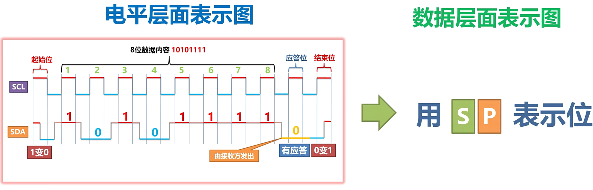

# I2C数据帧结构

[起始位] + [8位数据位] + [应答位] + [结束位]

起始位: SCL为高电平时(工作状态) 电平1 -> 0 : 下降沿

结束位: SCL为高电平时(工作状态) 电平0 -> 1 : 上升沿

应答位: SCL为高电平时(工作状态) 电平为0: 从机/主机应答 电平为1: 从机/主机未应答

注: 只有在SCL拉高为高电平时,数据线SDA上的电平信号才有效

在你给上子地址后,主机会记录数据直到掉电

# I2C简介

# 通信流程

# 寻址方式

# QUESTION

