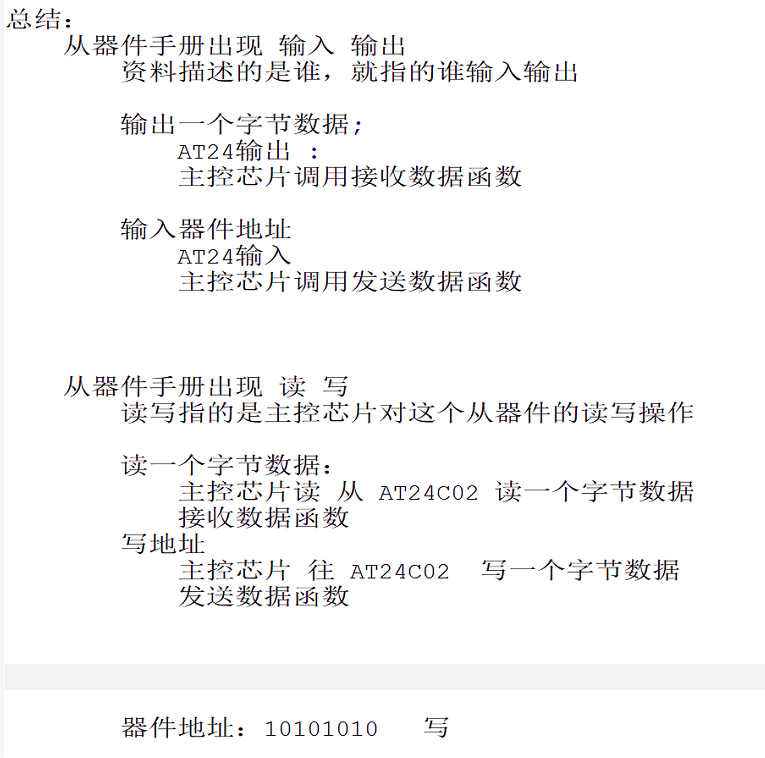

# 接触协议前须知

1. 物理层 2.协议层 3. 软件层

物理层: 电气特性(电平标准) + 硬件接口(结构形状) + 连接线 + 通信速率

协议层: 数据帧格式(帧头,帧尾,数据位的信息,如何校验?) + 通信时序(时序图)

# 基本知识

同步异步 串行并行 全双工/半双工/单工

串口通信的特点 物理层/

I2C的通信特点

通信控制器
IO口模拟时序

串口控制器的通信实现更可靠,但移植不方便

IO口模拟的 哪个引脚都可以,灵活配置

# 串口

# I2C

Q: I2C为什么要接上拉电阻

A:

v1.1(待修改和补充,写到哪说到哪,不成结构,须结构化输出)

I2C物理层实现的IO口结构为开漏结构,这种结构无法输出高电平,并且GPIO结构里的上拉电阻为弱上拉,其输出能力弱,所以需要在GPIO外外接一个上拉电阻,以满足SDA的高电平输出需求,当然有作为限流电阻的作用,防止GPIO口输出低电平时与外界形成短路

还有对于SCL/SDA,两者上拉电阻,能保证总线空闲时,保持高电平状态
